# useChatWebSocket Hook

A custom React hook for managing real-time chat interactions over WebSocket.  
It handles message sending/receiving, typing indicators, seen acknowledgements, and active user tracking.

This hook builds on top of [`useWebSocket`](./useWebSocket.ts), adding chat-specific logic.

---

## Features

- 📡 Connects to a WebSocket chat room.
- 💬 Receives and stores chat messages.
- ✍ Tracks and displays typing users with auto-timeout removal.
- ✅ Handles "seen" acknowledgements for messages.
- 🟢 Tracks active users in the room.
- 🔧 Simple API for sending messages, typing events, and seen events.

---

## Parameters

| Name    | Type   | Default | Description |
|---------|--------|---------|-------------|
| `log`   | `boolean` | `false` | If `true`, logs WebSocket events for debugging. |
| `roomID`| `number`  | **required** | The ID of the chat room to join. |

---

## Returns

| Name              | Type                  | Description |
|-------------------|-----------------------|-------------|
| `ws`              | `WebSocket \| null`   | The WebSocket instance (or `null` if not connected). |
| `isConnected`     | `boolean`             | Connection status. |
| `receivedMessages`| `ReceivedMessage[]`   | Array of received chat messages. |
| `typingUsers`     | `string[]`            | List of usernames currently typing. |
| `activeUsers`     | `string[]`            | List of active usernames in the room. |
| `sendMessage`     | `(message, username) => void` | Sends a chat message. |
| `sendTypingUsers` | `(username) => void`  | Sends a typing event. |
| `sendSeenBy`      | `(ids) => void`       | Sends a "seen" acknowledgement for messages. |

---

## Sequence Diagram



```mermaid
sequenceDiagram
    participant React Component
    participant useChatWebSocket
    participant useWebSocket
    participant WebSocket Server

    React Component->>useChatWebSocket: Mount with {roomID, log}
    useChatWebSocket->>useWebSocket: Connect to WebSocket (roomID)
    useWebSocket->>WebSocket Server: Connect
    WebSocket Server-->>useWebSocket: onopen → isConnected = true
    useWebSocket-->>useChatWebSocket: WebSocket instance

    WebSocket Server-->>useChatWebSocket: onmessage {type:"message"}
    useChatWebSocket->>React Component: Update receivedMessages

    WebSocket Server-->>useChatWebSocket: onmessage {type:"typing"}
    useChatWebSocket->>React Component: Update typingUsers (auto-remove after 3s)

    WebSocket Server-->>useChatWebSocket: onmessage {type:"user_status"}
    useChatWebSocket->>React Component: Update activeUsers

    React Component->>useChatWebSocket: sendMessage()
    useChatWebSocket->>WebSocket Server: Send JSON payload

    React Component->>useChatWebSocket: sendTypingUsers()
    useChatWebSocket->>WebSocket Server: Send {type:"typing"}

    React Component->>useChatWebSocket: sendSeenBy()
    useChatWebSocket->>WebSocket Server: Send {type:"seen"}
```

Got it ✅
I’ll make you a **README.md** for `useChatWebSocket` that:

* Explains what it is & when to use it
* Lists props, returned values, and usage
* Has a Mermaid **sequence diagram** showing the flow
* Stays simple and clean so it’s easy to read in GitHub

Here’s the draft:

---

````markdown
# useChatWebSocket Hook

A custom React hook for managing real-time chat interactions over WebSocket.  
It handles message sending/receiving, typing indicators, seen acknowledgements, and active user tracking.

This hook builds on top of [`useWebSocket`](./useWebSocket.ts), adding chat-specific logic.

---

## Features

- 📡 Connects to a WebSocket chat room.
- 💬 Receives and stores chat messages.
- ✍ Tracks and displays typing users with auto-timeout removal.
- ✅ Handles "seen" acknowledgements for messages.
- 🟢 Tracks active users in the room.
- 🔧 Simple API for sending messages, typing events, and seen events.

---

## Parameters

| Name    | Type   | Default | Description |
|---------|--------|---------|-------------|
| `log`   | `boolean` | `false` | If `true`, logs WebSocket events for debugging. |
| `roomID`| `number`  | **required** | The ID of the chat room to join. |

---

## Returns

| Name              | Type                  | Description |
|-------------------|-----------------------|-------------|
| `ws`              | `WebSocket \| null`   | The WebSocket instance (or `null` if not connected). |
| `isConnected`     | `boolean`             | Connection status. |
| `receivedMessages`| `ReceivedMessage[]`   | Array of received chat messages. |
| `typingUsers`     | `string[]`            | List of usernames currently typing. |
| `activeUsers`     | `string[]`            | List of active usernames in the room. |
| `sendMessage`     | `(message, username) => void` | Sends a chat message. |
| `sendTypingUsers` | `(username) => void`  | Sends a typing event. |
| `sendSeenBy`      | `(ids) => void`       | Sends a "seen" acknowledgement for messages. |

---

## Sequence Diagram

```mermaid
sequenceDiagram
    participant React Component
    participant useChatWebSocket
    participant useWebSocket
    participant WebSocket Server

    React Component->>useChatWebSocket: Mount with {roomID, log}
    useChatWebSocket->>useWebSocket: Connect to WebSocket (roomID)
    useWebSocket->>WebSocket Server: Connect
    WebSocket Server-->>useWebSocket: onopen → isConnected = true
    useWebSocket-->>useChatWebSocket: WebSocket instance

    WebSocket Server-->>useChatWebSocket: onmessage {type:"message"}
    useChatWebSocket->>React Component: Update receivedMessages

    WebSocket Server-->>useChatWebSocket: onmessage {type:"typing"}
    useChatWebSocket->>React Component: Update typingUsers (auto-remove after 3s)

    WebSocket Server-->>useChatWebSocket: onmessage {type:"user_status"}
    useChatWebSocket->>React Component: Update activeUsers

    React Component->>useChatWebSocket: sendMessage()
    useChatWebSocket->>WebSocket Server: Send JSON payload

    React Component->>useChatWebSocket: sendTypingUsers()
    useChatWebSocket->>WebSocket Server: Send {type:"typing"}

    React Component->>useChatWebSocket: sendSeenBy()
    useChatWebSocket->>WebSocket Server: Send {type:"seen"}
````

---

## Example Usage

```tsx
import useChatWebSocket from "./useChatWebSocket";

export default function ChatRoom({ roomID, username }) {
  const {
    receivedMessages,
    typingUsers,
    activeUsers,
    sendMessage,
    sendTypingUsers,
    sendSeenBy,
    isConnected
  } = useChatWebSocket({ log: true, roomID });

  return (
    <div>
      <h3>Status: {isConnected ? "Connected" : "Disconnected"}</h3>
      <ul>
        {receivedMessages.map((msg) => (
          <li key={msg.id}>{msg.sender}: {msg.content}</li>
        ))}
      </ul>
      <div>Typing: {typingUsers.join(", ")}</div>
      <div>Active: {activeUsers.join(", ")}</div>
      {/* Send events using sendMessage / sendTypingUsers / sendSeenBy */}
    </div>
  );
}
```

---

## Notes

* The hook automatically cleans up event listeners and timeouts when unmounted.
* Typing indicators are automatically removed after 3 seconds of inactivity.
* If the WebSocket is disconnected, sending events will fail silently and log a warning if `log` is enabled.

---
